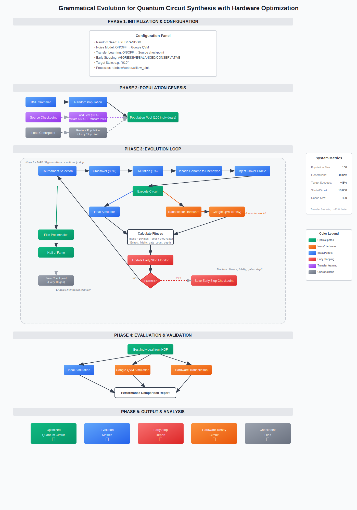
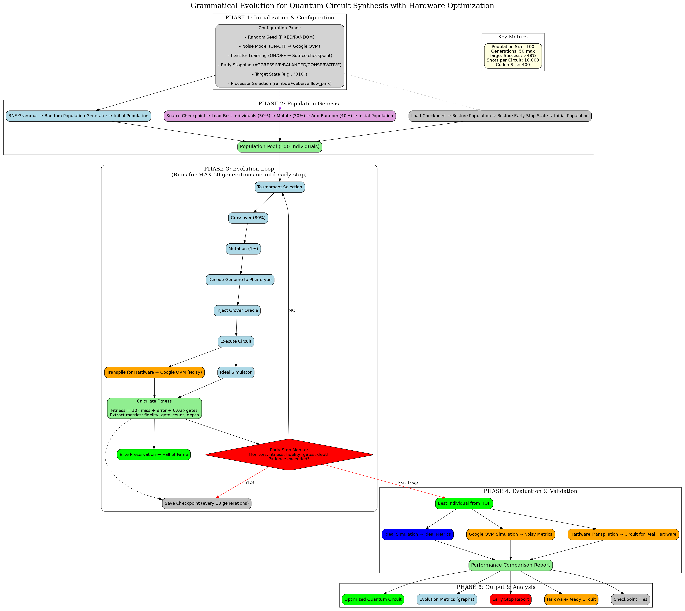

# Grammatical Evolution for Quantum Algorithm Synthesis
  
An AutoML system that automatically designs and optimizes quantum circuits using grammatical evolution, with implementations for both IBM Qiskit and Google Cirq platforms.

## Overview 

This repository demonstrates how **Grammatical Evolution (GE)** can be used to automatically synthesize quantum circuits that implement specific quantum algorithms. Rather than manually designing circuits, the system evolves them from scratch using a BNF grammar to ensure syntactic validity and genetic operators to optimize performance.



### Key Achievements

- Automatic circuit generation for Grover's algorithm (3-qubit)
- Cross-platform compatibility (IBM Qiskit & Google Cirq)
- Hardware-aware optimization with real noise models
- Transfer learning across platforms (Qiskit → Cirq)
- 100% fidelity achieved with optimized gate counts

## Features

### Core Capabilities

- **Grammar-Based Circuit Generation**: BNF grammars define valid quantum circuit syntax
- **Multi-Objective Optimization**: Balances fidelity, gate count, and circuit depth
- **Hardware Simulation**: Tests on real quantum virtual machines (IBM & Google)
- **Transfer Learning**: Reuses knowledge from previous evolutions (30% transfer + 30% mutated + 40% new)
- **Smart Early Stopping**: NISQ-focused metrics prevent over-optimization
- **Checkpoint/Resume**: Never lose progress with full state preservation
- **Deterministic Evaluation**: Individual-level seeding ensures reproducibility

### Platform-Specific Features

#### IBM Implementation (`IBM_Grover_Implementation/`)

- IBM Quantum backend integration
- Qiskit transpilation for real hardware
- Support for multiple IBM processors
- Noise model simulation

#### Google Cirq Implementation (`Cirq_Grover_Implementation/`)

- Google QVM integration
- Sycamore gateset optimization
- Support for rainbow/weber/willow processors
- Cross-platform transfer learning from IBM

## Repository Structure

```
GRAMMATICAL-EVOLUTION-FOR-QUANTUM-ALGORITHMS/
│
├── IBM_Grover_Implementation/          # IBM Qiskit implementation
│   ├── Grover_000.ipynb         # Main evolution notebook
│   ├── grammars/                      # BNF grammar files
│   │   └── grover.bnf                 # Grover-specific grammar
│   ├── logs**/                          # Evolution logs
│
├── Cirq_Grover_Implementation/         # Google Cirq implementation
│   ├── cirq_grover_noise_modelling.ipynb    # Main evolution notebook
│   ├── grammars/                      # BNF grammar files
│   │   └── cirq_grover.bnf               # Cirq-specific grammar
│   ├── logs**/                          # Evolution logs
│   └── checkpoints_google_ideal/                   # Saved states
│
├── quantum_circuit_evolution_flowchart.png  # System architecture diagram
├── requirements.txt                    # Python dependencies
└── README.md                         
```

## How It Works



1. **Grammar Definition**: BNF grammar defines valid quantum gate combinations
2. **Population Initialization**: Generate random valid circuits or use transfer learning
3. **Evolution Loop**:
   - Decode genomes to quantum circuits
   - Inject problem-specific oracles
   - Evaluate on simulator (ideal or noisy)
   - Calculate multi-objective fitness
   - Apply selection, crossover, and mutation
4. **Early Stopping**: Monitor fidelity, gates, and depth independently
5. **Output**: Optimized, hardware-ready quantum circuits

## Results

### Example: Grover's Algorithm (3-qubit, marked state |010⟩)

- **Initial Performance**: ~4.7% success rate (random)
- **Final Performance**: 100% fidelity
- **Evolution Time**: 15 generations (early stopped from 50)
- **Efficiency Gain**: 70% computation time saved
- **Gate Optimization**: Reduced from 21 to 16 gates
- **Cross-Platform Transfer**: IBM → Cirq knowledge transfer successful

# Install dependencies

pip install -r requirements.txt

```

##  Quick Start

### IBM Qiskit Version

```bash
cd IBM_Grover_Implementation
```

### Google Cirq Version

```bash
cd Cirq_Grover_Implementation
```

### Configuration Options

- `USE_NOISE_MODEL`: Enable/disable hardware noise simulation
- `USE_TRANSFER_LEARNING`: Leverage previous evolution results
- `USE_EARLY_STOPPING`: Enable NISQ-focused early stopping
- `EARLY_STOPPING_MODE`: Choose between aggressive/balanced/conservative
- `TARGET_STATE`: Specify which state to mark (e.g., "010", "101")

## Advanced Features

### Transfer Learning

```python
# Transfer from IBM to Cirq
SOURCE_CHECKPOINT = "./checkpoints_google_ideal/checkpoint_latest.pkl"
TRANSFER_RATIO = 0.3  # Use 30% of best individuals
```

### NISQ-Era Optimization

```python
# Hierarchical optimization strategy
FIDELITY_SUCCESS_THRESHOLD = 0.95  # Target fidelity
GATE_COUNT_TARGET = 20             # Maximum gates
DEPTH_TARGET = 15                  # Maximum depth
```

## Future Algorithms

The framework is designed to be extensible. To implement a new quantum algorithm:

1. Create a new folder (e.g., `QFT_Implementation/`)
2. Define the appropriate BNF grammar
3. Implement the oracle/problem-specific components
4. Configure the fitness function
5. Run the evolution!

Quantum Machine Learning Algorithms to Explore:

- Quantum Support Vector Machine (QSVM) - Classification using quantum kernel methods
- Variational Quantum Classifier (VQC) - Parameterized circuits for classification
- Quantum Neural Networks (QNN) - Quantum circuits as neural network layers
- Quantum Boltzmann Machines (QBM) - Quantum sampling for generative models
- Quantum Autoencoders - Compression and feature extraction
- Quantum GANs (qGAN) - Quantum generative adversarial networks
- Quantum k-Means - Clustering with quantum speedup
- Quantum Principal Component Analysis (qPCA) - Dimensionality reduction
- Quantum Reinforcement Learning circuits - Decision-making circuits
- Quantum Kernel Alignment - Optimizing quantum kernels for specific datasets

## Contributing

Contributions are welcome! Feel free to:

- Add new quantum algorithm implementations
- Improve the grammatical evolution engine
- Add support for other quantum platforms
- Optimize the fitness functions

## Dependencies

- Python 3.8+
- [GRAPE](https://github.com/bdsul/grape) - Grammatical Evolution library
- Qiskit - IBM quantum computing SDK
- Cirq - Google quantum computing framework
- NumPy, Matplotlib, DEAP - Scientific computing
- See `requirements.txt`

## Acknowledgments

- IBM Quantum Network for quantum cloud access
- Google Quantum AI for Cirq and QVM
- GRAPE library developers for the GE framework

---

*This project demonstrates that evolutionary computation can effectively tackle the challenge of quantum circuit synthesis, opening new possibilities for automated quantum algorithm design.*
